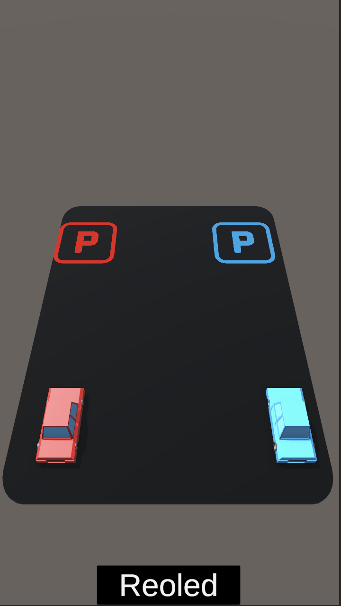

# Car Park Line Clone

Car Park Line Clone is a Unity-based puzzle game where players guide cars to their respective parking spots by drawing paths. The objective is to ensure that cars are parked in their designated spots without colliding with one another.

## Features

- **Line Drawing Mechanics**: Use intuitive drag-and-draw controls to create paths for cars.
- **Dynamic Parking Logic**: Cars are guided to parking spaces of matching colors.
- **Collision System**: Levels reset upon car collisions for a challenging experience.
- **Level Progression**: Gradually increasing complexity with multiple cars and parking spots.
- **Visual Feedback**: Particle effects and animations enhance gameplay.

---

## How to Play

1. Click and drag to draw paths connecting cars to their matching parking spots.
2. Avoid overlapping paths to prevent collisions.
3. Successfully park all cars to proceed to the next level.
4. Reset the level anytime using the "Reoled" button.

---

## Project Overview

### Key Scripts

1. **Car.cs**  
   Manages car movement, animations, and collision handling.

2. **Game.cs**  
   Controls game state, level progression, and collision events.

3. **Line.cs**  
   Handles line rendering and point validation during path drawing.

4. **LinesDrawer.cs**  
   Integrates user input with line drawing and path validation logic.

5. **Park.cs**  
   Detects successful parking and triggers visual feedback.

6. **UIManager.cs**  
   Provides UI updates for line availability and game transitions.

### Visuals

The game uses simple 3D models with clean, colorful aesthetics for cars and parking spots.

---

## Dependencies

- **Unity Engine** 2021.3.29f1
- **DOTween**: Animation management.

---

## Installation

1. Clone or download the repository to your local machine.
2. Open the project in Unity.
3. Ensure DOTween is installed via the Unity Package Manager.
4. Run the game from the Unity Editor.

---

---

